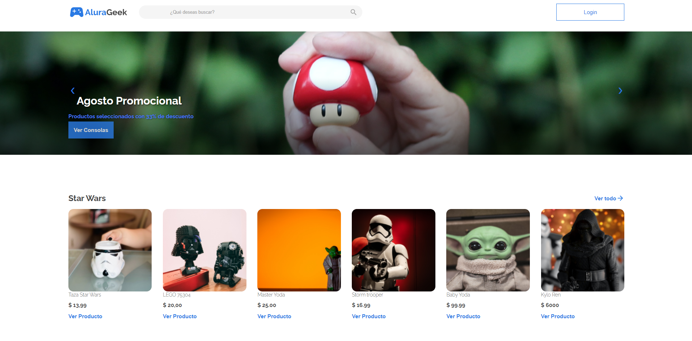
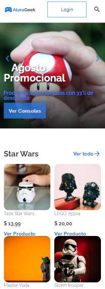
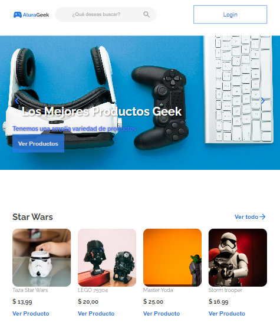

# AluraGeek E-Commerce App

Bienvenido a AluraGeek, una aplicación de e-commerce donde podrás encontrar una amplia variedad de productos geek, desde consolas y accesorios hasta coleccionables de tus series y películas favoritas.

## Características

- Explora una amplia gama de productos categorizados para satisfacer tus intereses geek.
- Detalles de producto: obtén información detallada, incluyendo imágenes, precios y descripciones.
- Búsqueda avanzada: filtra y busca productos por nombre, categoría y precio.
- Productos similares: descubre productos relacionados mientras navegas por los detalles de un producto.
- Promociones y descuentos: mantente al tanto de nuestras ofertas y promociones especiales.
- Experiencia móvil: disfruta de una experiencia de usuario responsive y optimizada para dispositivos móviles.

## Capturas de Pantalla

## Instalación

1. Clona este repositorio: `git clone https://github.com/carlosalegriam/e-commerce/`
2. Navega a la carpeta del proyecto: `cd AluraGeek-Ecommerce`
3. Instala las dependencias: `npm install`
4. Inicia la aplicación: `npm start`

## Tecnologías Utilizadas

- HTML, CSS y JavaScript para el frontend.
- Node.js y Express para el backend.
- MongoDB para la base de datos.

## Contribuciones

Si deseas contribuir a este proyecto, ¡te damos la bienvenida! Puedes abrir un _issue_ o enviar un _pull request_ con tus mejoras.

## Licencia
Este proyecto está bajo la Licencia MIT. Consulta el archivo [LICENSE](LICENSE) para más detalles.
